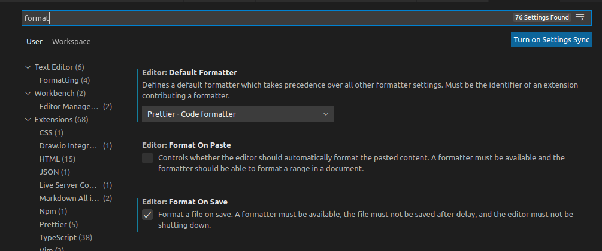
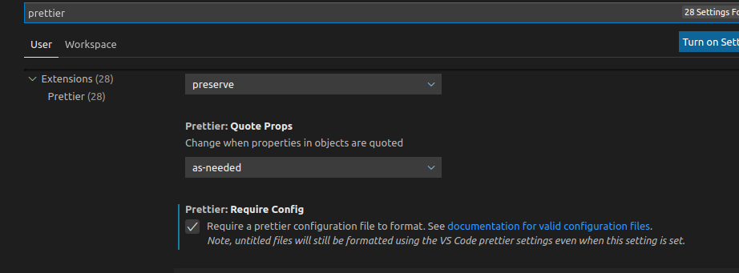

# cse110-sp21-group4

[Team Page](https://github.com/cse110-sp21-group4/cse110-sp21-group4/blob/main/admin/team.md)

## How to Contrubute

### Before Coding

- Make sure node.js is installed correctly on your system
- Please install **Prettier Code Formatter** extension before coding(It will be hard to pass the checks on CI/CD without auto formatting)
- Change VSCode configurations
  - "Default Formatter" to "Prettier-Code formatter"
  - Check "Format on Save"
  - Check "Prettier:Require Config"




- **The build process works on Linux/Mac system. Please contact me if you have to code in Windows**

### Directories

- source

  - css: all css file
  - js: all js file
  - js/tests: unit test files
  - images: all image files
  - build: build outputs, files that actually working
    - The actual working js and css files are located in this folder
    - The js files in js/, js/tests and css/ will be taken care of by the building process, do not add additional js or css files in index.html.

- **Please do not modify other files in the "source" directory, they are configuration files. Any modifications to those files will affect every one in the team**
- **Please tell me if you're going to change fhe project file structure. It may mess up the CI/CD pipeline.**

### Building Project

- Please build the project as the following if you want to see the result of your code at any point

```Shell
#In source folder

./build.sh #./build.sh -i if it's the first time

```

### Unit Testing

- Test files are located in js/tests, you can create any test file in this folder. (Please refer the example test in this directory)
- Run tests: Build the project, the building process includes building the tests and run them.

### Git

- Create feature branch before coding anything
- Pull and merge main frequently(as frequent as multiple times a day) to reduce the possibility of conflictions.
- Always pull and merge main branch before you create the pull request.

### Recommandations

- Create independent widgets or modules for different parts of the application.
- Reduce the lines of code in index.html, style.css, script.js files. (The code will be impossible to maintain if we put all things together, try to modulize the code.)
