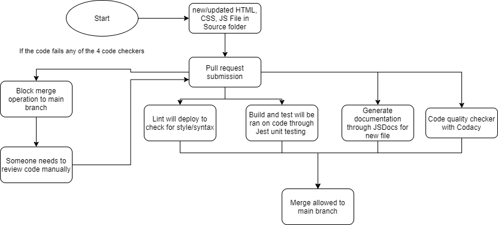

# Phase 1 of CI/CD Pipeline

This document showcases the our current interation of the CI pipeline. 

## Diagram 

## How is the CI Pipeline invoked?
- Once a pull request is initiated on the source folder. The following tests will run. 
   
## Code Style/Syntax
- Using the super-linter repository, it will check for style guidlines.
- This action will be called everytime someone makes a pull request on the source folder.
- We use Prettier to check the code style within the super-linter repository. 
- In order to enforce the coding style, we locally add VS Code extensions. 

## Build and Unit Test
- Will build the code up to get ready for unit testing through Jest.
  
## Generate Documentation
- Will create documentation for the following code through the use of JSDocs.
  
## Quality Check
- Using Codacy, this will check the code for quality. 

## If All Tests Pass
- There will a final manual review by a teammate before merge branch to main. 
  
## If Failure Occurs
- If any of the previous test fails during the code check process, the code will be redirected to a manual review by a teammate. After review, the code will then be sent back through the 4 code checking process. 

## Issues of Our Pipeline
- We are using default configuration for Codacy and this presents us with some rules that does not align with our purposes. 
- For example, there are some styling issues that were flagged in the security issues within GitHub. 
- Specifically, the "Rule doesn't have all its properties in alphabetical order." 
- CI/CD Action Jobs are not showing up on the pull request `Conversation` tab. However, it does show up on the `Checks` tab.
- We couldn't yet get E2E testing to work within the pipeline, but for now focus on unit testing
  
## Future Iterations of Pipeline
- We want to include continuous integration for deployment, minification and test coverage within our pipeline. 
- We hope to include E2E testing of the app in the future
- We hope to have deployment implemented into our second interation of our CI pipeline. 
  
