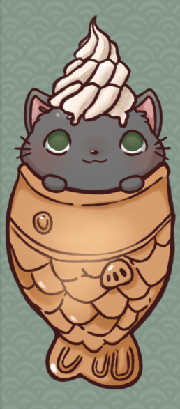

<h1 align="center"> TaiyaKITTY :smiley_cat: </h1>

## Our Team 

  

  <strong>:goat: Tri Tran</strong>
    
  

  Math-CS | Junior
  https://github.com/tqt001

  

    <strong>:suspect: Ishaan Gupta</strong>
  

  CS: Bioinfomatics | Sophomore
  https://github.com/IshaanSD
  Passionate towards studying and implementing algorithms used in Biology and Machine Learning.

#### 

  

    <strong>:bust_in_silhouette: Yang Lu</strong>
    
  

  CS | Junior
  https://github.com/kevinlu1736

  

    <strong>:octocat: Ranjodh Singh</strong>
    
  

  CS | Junior
  https://github.com/rsingh84
  Love gaming and taking walks on the beach. 

  

    <strong>:fish: Christopher Vu</strong>
    
  

  CS | Sophomore
  https://github.com/crystoffar

  

    <strong>:hatched_chick: Bozhi Wang</strong>
    
  

  ECE:Computer Engineer | Junior
  https://github.com/Bowang1337

  

    <strong>:running: Darian Hong</strong>
    
  

  CS | Sophomore
  https://github.com/DurianH

  

    <strong>:information_desk_person: Zhongkang(Ken) Fang</strong>
    
  

  ECE:Computer Engineer | Junior
  https://github.com/z4fang

## Our Values 🌟
<ul>
  <li> <em>TaiyaKITTY</em> teaches us to always creative, open to new and seemingly unorthodox ideas. </li>
  <li> <em>TaiyaKITTY</em> always trusts comrades, and believes in using individual thinking with group decisions and communication to excel as a team.</li>
  <li> All people are important to <em>TaiyaKITTY</em>, with their feelings, aspirations, thoughts and goals respected at all times. </li>
  <li> Gaming is a culture that binds us together at <em>TaiyaKITTY</em></li>
</ul>

